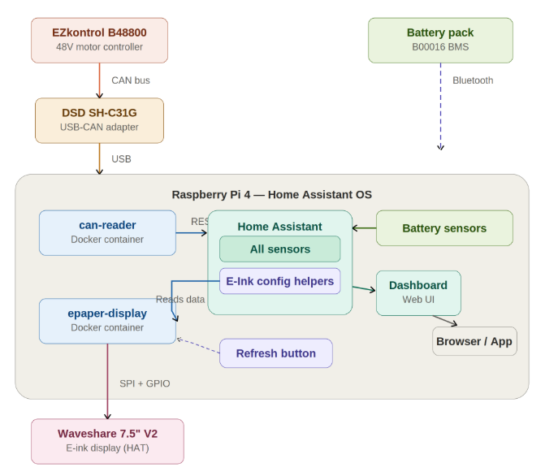
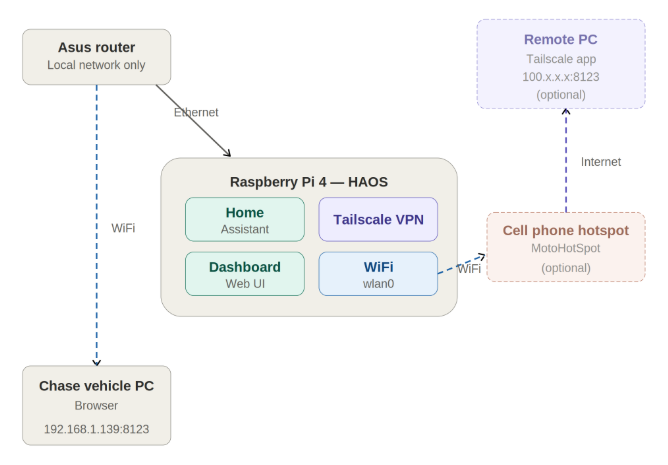

#  Solar Storms Telemetry System
**Raspberry Pi + Home Assistant Setup Guide**  
---


**Hardware**: Raspberry Pi 4, Waveshare 7.5" e-ink display, DSD TECH SH-C31G USB-CAN adapter  
**Network**: ASUS router and cabling, optional cell phone with hotspot enabled  
**Software**: Home Assistant OS, Docker containers, Python + gpiod + SocketCAN  
**Interfaces**: SPI (display), CAN bus (motor controller), Bluetooth (battery BMS), Ethernet and Wifi  
**Features**: Live dashboard, configurable e-ink display, CAN bus decoder, bluetooth battery connection  

Devices on solar car:
- Battery: bestgo
- BWPFE51100ATIPF (Os as zeros) — 51V 100Ah PFE-series LiFePO4 pack
- Motor control : ezkontrol


## Table of contents

1. [System overview](#1-system-overview)
2. [Prerequisites](#2-prerequisites)
3. [Initial setup: Home Assistant OS](#3-initial-setup-home-assistant-os)
4. [Waveshare 7.5" e-ink display setup](#4-waveshare-75-e-ink-display-setup)
5. [E-ink display: Home Assistant integration](#5-e-ink-display-home-assistant-integration)
6. [CAN bus: EZkontrol motor controller](#6-can-bus-ezkontrol-motor-controller)
7. [Battery BMS: Bluetooth integration](#7-battery-bms-bluetooth-integration)
8. [System maintenance & commands](#8-system-maintenance--commands)
9. [Network setup discussion](#9-network-setup-discussion)
10. [Andy left to do](#10-andy-left-to-do)
11. [Student to do (with Andy help)](#11-student-to-do-with-andy-help)

## Repository layout

What runs on the car vs. what is tooling:

| Path | Role |
| --- | --- |
| `CANbus_data/ha_addons/solar-car-canbus/` | **Production** — HA add-on: decodes the shared CAN bus, pushes sensors. Carries a vendored copy of `solarcar_can` (regenerate with `sync_addon.py`). |
| `display/addon/` | **Production** — HA add-on: renders the e-ink dashboard from HA sensors. |
| `display/ha/` | HA dashboard YAML for the e-ink message/warning cards. |
| `CANbus_data/solarcar_can/` | **The** CAN protocol library (BESTGO + EZkontrol decoders, transports). Single source of truth — edit here, never in the vendored copy. |
| `CANbus_data/` (root scripts) | Cross-platform CLI dashboards (`monitor.py`, `bestgo_decode.py`, `ezkontrol_decode.py`), `sync_addon.py`, SSH helpers; see `CANbus_data/SETUP.md`. |
| `CANbus_data/tools/`, `CANbus_data/tests/` | Bus diagnostics; golden-master decoder tests + captured fixtures. |
| `CANbus_data/specs/` | Vendor protocol PDFs and extracted notes. |
| `simulator/` | Pushes realistic fake telemetry to HA — drives the display with no hardware. |
| `mapping/` | Race-route elevation tooling (`fetch_elev.py`, `build_viewer.py` → `viewer.html`). |
| `archive/` | Superseded code kept for reference (old BLE battery GUI, Pi decode-test containers) — see `archive/README.md`. |
| `PI_TODO.md` | Running list of tasks waiting on the Pi being powered up. |

## 1. System overview
This guide documents the complete setup of a solar car monitoring system built on a Raspberry Pi 4 running Home Assistant OS. The system integrates three external hardware interfaces and presents data through both a web dashboard and a physical e-ink display.




### Architecture
The system consists of three external devices connected to a Raspberry Pi 4:  
**EZkontrol B48800** — 48V BLDC motor controller connected via CAN bus through a DSD TECH SH-C31G USB-to-CAN adapter. Broadcasts voltage, current, speed, temperatures, and error status every 100ms.  
**Battery pack (B00016 BMS)** — Connected via Bluetooth using the BLE Battery Management System integration in Home Assistant. Provides stored energy, battery level, and other BMS data.  
**Waveshare 7.5" V2 e-ink display** — Connected via the SPI bus and GPIO pins through the e-Paper Driver HAT. Renders a fixed solar-car dashboard from Home Assistant sensors — an analog speedometer, battery state-of-charge, temperature bar graphs, and a messages area. It refreshes only the screen regions that change (partial refresh, no flash) and deep-sleeps the panel when telemetry stops, so the image stays visible with no wear.  
### Software architecture
Two services run on the Pi alongside Home Assistant OS:
| Service | Purpose | Key detail |
| --- | --- | --- |
| solar-car-canbus | HA app — reads the CAN bus, pushes sensors to HA | both devices on one shared bus, REST API |
| solar_epaper | HA app — reads HA sensors, draws the dashboard to the e-ink screen | fixed solar-car layout, configurable via app options |


Both run as Home Assistant apps and restart with HA. `solar-car-canbus` brings up the CAN interface itself; the `solar_epaper` display app runs with full access to /dev for SPI/GPIO. Each talks to HA through the Supervisor proxy, so neither needs a long-lived token.  

## 2. Prerequisites
### Hardware
| Component | Details |
| --- | --- |
| Raspberry Pi 4 | 4GB+ RAM recommended |
| microSD card | 32GB+ for Home Assistant OS |
| Waveshare 7.5" V2 e-Paper HAT | 800x480 resolution, SPI interface |
| DSD TECH SH-C31G | USB-B to CAN adapter, candlelight firmware |
| EZkontrol B48800 | 48V BLDC motor controller with CAN output |
| Battery with BLE BMS | Bluetooth-enabled battery management system |
| USB power supply | 5V 3A+ for the Raspberry Pi |


### Software
Built with Claude in this [context](https://claude.ai/share/ac0488df-1b63-45a8-bcfc-a0aab504916a)  

Home Assistant OS (HAOS) installed on the Pi via Raspberry Pi Imager. The Advanced SSH & Web Terminal add-on must be installed with Protection Mode disabled to allow Docker access and GPIO/SPI operations.  
The two HA apps talk to HA through the Supervisor proxy and need **no** token. A Long-Lived Access Token is only needed for the optional PC-side tools (`simulator/solar_sim.py`, the SSH helpers) — see Section 3.4. Store it in the `HA_TOKEN` environment variable, never in this repo.  

## 3. Initial setup: Home Assistant OS
### 3.1 Flash HAOS to SD card
Use Raspberry Pi Imager to flash Home Assistant OS onto a microSD card. Select your Pi 4 as the device, choose 'Other specific-purpose OS > Home assistants and home automation > Home Assistant > Home Assistant OS'. Configure WiFi and SSH in the imager settings if desired.  
Insert the SD card into the Pi and power on. Wait several minutes for the first boot. Access the web interface at [http://homeassistant.local:8123](http://homeassistant.local:8123).  

### 3.2 Install SSH add-on
From the HA web interface:  
1. Go to Settings > Add-ons > Add-on Store
2. Search for Advanced SSH & Web Terminal
3. Install it and configure a password or SSH key
4. Disable Protection Mode (toggle in add-on settings) — required for Docker and hardware access
5. Start the add-on
> [!WARNING]
> Disabling Protection Mode gives the SSH add-on full system access including Docker. Only do this if you trust your network environment.
### 3.3 Install BLE Battery Management System : NOTE not used in current version, but left for fallback
1. Go to Settings > Devices & Services > Integrations
2. Click + Add Integration
3. Search for BLE Battery Management System
4. Follow the on-screen instructions to discover and pair your battery's Bluetooth BMS
5. Once connected, battery sensors will appear automatically
> [!NOTE]
> The BLE BMS integration discovers batteries automatically over Bluetooth. Make sure the battery is powered on and within range.
### 3.4 Generate long-lived access token
1. Click your profile icon (bottom left of HA sidebar)
2. Scroll to Long-Lived Access Tokens
3. Click Create Token, give it a name (e.g., 'Docker Containers')
4. Copy the full token immediately — it won't be shown again
```text
<your-long-lived-token>   # do NOT commit the real token — store it in the HA_TOKEN environment variable
```
5. Save it securely (outside this repo) — you'll need it for the PC-side scripts; the HA apps themselves use the Supervisor proxy and need no token

> [!NOTE]
> Home Assistant gives a warning in the logs about other software running, it can be ignored.

## 4. Waveshare 7.5" e-ink display setup
### 4.1 Physical connection
> [!CAUTION]
> Power off the Raspberry Pi before connecting any hardware.
1. Plug the e-Paper Driver HAT onto the Pi's 40-pin GPIO header, aligning the pins carefully
2. Connect the ribbon cable from the display to the HAT connector — lift the small black latch, slide the ribbon in, press the latch back down
3. Power the Pi back on


### 4.2 Verify SPI and environment
SSH into the Pi and verify:
```zsh
ls /dev/spi*
# Should show: /dev/spidev0.0  /dev/spidev0.1

python3 --version
# Should show Python 3.12+

pip3 install RPi.GPIO spidev Pillow numpy gpiozero gpiod
```
### 4.3 Key challenge: HAOS container restrictions
Home Assistant OS runs apps in sandboxed Docker containers. Even with Protection Mode disabled, the SSH add-on cannot directly open SPI devices. The solution is to package the display code as its own HA app that runs privileged with `/dev` access (`full_access: true`).  
Additionally, the Waveshare Python library uses gpiozero which doesn't work in this environment. The library must be patched to use gpiod (the modern Linux GPIO character device interface) instead. The CS pin (GPIO 8) must also be excluded since SPI hardware manages it automatically.  
### 4.4 The solar_epaper app build
The display ships as a Home Assistant app — the source is in `display/addon/` in this repo; on the Pi it goes in `/addons/solar_epaper/` and installs from **Settings > Apps > App Store > Local apps** (same flow as the CANbus app in Section 6.3). There is no manual `docker build`/`docker run` — HA builds the image from the app's `Dockerfile` and starts it on boot.  

The app's `Dockerfile` does the patching automatically at build time: it clones the Waveshare e-Paper library, then runs `patch.py` to convert it from gpiozero to gpiod.  
##### patch.py — patches the Waveshare library to use gpiod
`patch.py` rewrites `epdconfig.py`, replacing all gpiozero references with gpiod equivalents. Key changes:
- Replaces gpiozero.LED and gpiozero.Button with gpiod.request_lines
- Excludes GPIO 8 (CS pin) since SPI manages it
- Replaces digital_write/digital_read with gpiod set_value/get_value
- Updates module_init and module_exit to use gpiod

The full `patch.py` and the app's `Dockerfile` live alongside `display.py` in `display/addon/`.  
##### Quick hardware test (optional)
To confirm the panel and wiring before running the app, you can exec into the built app's container and run the Waveshare demo:
```zsh
cd /e-Paper/RaspberryPi_JetsonNano/python/examples
python3 epd_7in5_V2_test.py
```

## 5. E-ink display: Home Assistant integration
### 5.1 Display script
The display script (`display.py`) renders a fixed solar-car dashboard onto the 800x480 panel:
- **Header** — team logo + title + clock
- **Left-top** — analog speedometer gauge (mph / km/h / rpm; converts raw motor rpm using the configured wheel diameter and gear ratio)
- **Left-bottom** — messages area (high-temperature warnings plus a free-text message from HA)
- **Right-top** — battery icon (state of charge) + pack voltage
- **Right-bottom** — four temperature bar graphs (motor / EZkontrol / battery / Pi)

It reads its sensors straight from the HA REST API (via the Supervisor proxy) and is built around panel longevity: it samples speed every few seconds and the slower values (temps / SoC / message) less often, **refreshes only the regions that actually changed** (partial refresh, no flash), does an occasional fast full refresh to clear ghosting, and after a period with no telemetry change settles the image and puts the panel into **deep sleep** — the image stays visible with zero power draw and zero wear, waking automatically on the next change. If every CAN-fed sensor goes stale it shows a "CAN bus not connected" frame instead of stale readings.  
### 5.2 Create HA helpers
The app drives three optional HA helpers (Settings > Devices & Services > Helpers). Their entity IDs are set in the app's Configuration tab (defaults shown):  
| Helper type | Suggested name | Entity ID (app option) | Purpose |
| --- | --- | --- | --- |
| Text | EInk Message | `input_text.eink_message` (`ent_message`) | free-text line shown in the messages area |
| Toggle | EInk Display | `input_boolean.eink_display` (`ent_power`) | turn the panel on/off (clears the screen when off) |
| Button | EInk Refresh | `input_button.eink_refresh` | forces a full de-ghosting refresh |

> [!NOTE]
> The refresh button entity ID is fixed at `input_button.eink_refresh`. The message and power entities are configurable in the app options. If a helper is absent the app still runs — the panel just defaults to ON with no message.
### 5.3 Dashboard control card
Add an Entities card to your dashboard with this YAML:  
```yaml
type: entities
title: E-Ink Display Control
entities:
  - entity: input_boolean.eink_display
    name: Display Power
  - entity: input_text.eink_message
    name: Message
  - entity: input_button.eink_refresh
    name: Refresh Display Now
```
### 5.4 Install and configure the app
Copy `display/addon/` to `/addons/solar_epaper/` on the Pi, then install it from **Settings > Apps > App Store > Local apps** and start it (it is set to start on boot). All settings live in the app's **Configuration** tab — no environment variables or tokens to set by hand.  

| Option | Default | Purpose |
| --- | --- | --- |
| title | SOLAR STORMS | header title text |
| speed_unit | mph | speedometer unit: `mph`, `kmh`, or `rpm` |
| wheel_diameter_in | 20 | drive wheel diameter (in), for rpm → speed conversion |
| gear_ratio | 1 | motor revs per wheel rev |
| speed_max | 40 | speedometer full-scale, in `speed_unit` |
| temp_unit | C | temperature display unit: `C` or `F` |
| temp_max | 80 | temperature bar full-scale, in `temp_unit` |
| temp_warn | 65 | high-temp warning threshold, in `temp_unit` |
| speed_poll | 2.5 | seconds between speedometer samples |
| slow_poll | 6 | seconds between temp / SoC / message samples |
| full_refresh_every | 90 | partial pushes between de-ghosting full refreshes |
| idle_sleep | 180 | seconds of no change before the panel deep-sleeps |
| ent_speed | sensor.ezkontrol_motor_speed | motor speed (rpm) source entity |
| ent_t_motor | sensor.ezkontrol_motor_temp | motor temperature entity |
| ent_t_ezk | sensor.ezkontrol_controller_temp | controller temperature entity |
| ent_t_batt | sensor.bestgo_pack_temp | battery pack temperature entity |
| ent_t_pi | sensor.system_monitor_processor_temperature | Pi CPU temperature entity |
| ent_soc | sensor.bestgo_soc | battery state-of-charge entity |
| ent_voltage | sensor.bestgo_pack_voltage | pack voltage entity |
| ent_message | input_text.eink_message | free-text message helper |
| ent_power | input_boolean.eink_display | on/off toggle helper |

> [!NOTE]
> The default entity IDs match the `solar-car-canbus` app's sensors (Section 6.3), so with no hardware connected you can drive the display from the simulator (`simulator/solar_sim.py`), which pushes realistic values to those same entities.

## 6. CAN bus: EZkontrol motor controller
### 6.1 Hardware wiring
Connect the EZkontrol's CN2 connector to the DSD TECH SH-C31G USB-CAN adapter:
| EZkontrol pin | Wire color | Signal | SH-C31G terminal |
| --- | --- | --- | --- |
| CN2-10 | Yellow | CAN_H | CAN_H |
| CN2-21 | Green | CAN_L | CAN_L |
| CN2-22 | Black | CAN_GND | GND |


> [!NOTE]
> Enable the 120 ohm termination resistor on the SH-C31G if it is the last device on the CAN bus. The EZkontrol has its own 120 ohm termination enabled by default (brown wire CN2-11).
### 6.2 CAN protocol: MCU-to-METER (read-only)
The EZkontrol broadcasts two J1939 extended CAN frames every 100ms. This is a passive protocol — no handshake required.  
The solar car runs the EZkontrol motor controller and the BESTGO battery on **one shared CAN bus at 500 Kbps**, so the EZkontrol must use 500 Kbps too. Use the “EZ-Tune” Android app to set its CAN protocol to **101** — the 500 Kbps MCU-to-Meter (passive telemetry) variant. Do **not** use 102: that is the MCU-to-VCU variant, in which CAN takes over throttle/gear/brake. The controller shipped defaulted to 1. The setting persists across power cycles.

| Protocol | Mode | Rate |
| --- | --- | --- |
| 1 | MCU-to-Meter (passive telemetry) | 250K |
| 2 | MCU-to-VCU (CAN takes over throttle/gear/brake) | 250K |
| 101 | MCU-to-Meter | 500K ← what you want |
| 102 | MCU-to-VCU | 500K ← what you just set |

##### Message I — CAN ID 0x180117EF
| Bytes | Data | Resolution | Offset | Range |
| --- | --- | --- | --- | --- |
| 0-1 | Bus voltage | 0.1 V/bit | 0 | 0 - 300 V |
| 2-3 | Bus current | 0.1 A/bit | -3200 A | -3200 - 3200 A |
| 4-5 | Phase current | 0.1 A/bit | -3200 A | -3200 - 3200 A |
| 6-7 | Speed | 0.1 rpm/bit | -32000 rpm | -32000 - 32000 rpm |


All values are little-endian unsigned 16-bit. Formula: physical = raw * resolution + offset  
#### Message II — CAN ID 0x180217EF
| Byte | Data | Resolution | Offset |
| --- | --- | --- | --- |
| 0 | Controller temp | 1 C/bit | -40 C |
| 1 | Motor temp | 1 C/bit | -40 C |
| 2 | Throttle % | 1%/bit | 0 |
| 3 | Status (gear, brake, mode) | Bitfield | — |
| 4-6 | Error flags (22 faults) | Bitfield | — |
| 7 | Life signal (bits 7-4) | Counter | 0 |


### 6.3 The solar-car-canbus app
One Home Assistant **app** (HA's current term for what used to be called an
"add-on"), `solar-car-canbus`, decodes the CAN bus. It reads **both** the
EZkontrol motor controller and the BESTGO battery from the single shared
bus, decodes them, and pushes named sensors to Home Assistant over the REST
API. The two devices coexist on one bus because their IDs don't overlap —
the EZkontrol uses 29-bit extended IDs (`0x1801xxxx`), the BESTGO BMS uses
11-bit standard IDs (`0x351`–`0x379`).

The app source is in `CANbus_data/ha_addons/solar-car-canbus/` in this repo;
on the Pi it is placed in `/addons/solar-car-canbus/` and installed from
**Settings > Apps > App Store > Local apps**.

The frame-decoding logic lives in the shared `CANbus_data/solarcar_can/`
package — the single source of truth for both protocols, used by this app
and by the cross-platform CLI dashboards (`CANbus_data/monitor.py`,
`bestgo_decode.py`, `ezkontrol_decode.py`; see `CANbus_data/SETUP.md`).
The app folder carries a **vendored copy** of the package (HA builds local
apps with the app folder as the Docker context): after editing
`solarcar_can/`, run `python CANbus_data/sync_addon.py` and rebuild the
app. Golden-master tests (`CANbus_data/tests/test_decoders.py`) replay real
bus captures from `tests/fixtures/` through the decoders.

It publishes 41 sensors:
- 13 `sensor.ezkontrol_*` — bus voltage/current, phase current, motor speed,
  controller/motor temperature, throttle, gear, brake, contactor, errors.
- 21 `sensor.bestgo_*` — SOC/SOH, pack voltage/current/temperature, cell
  min/max voltage and temperature, charge/discharge limits, alarms, capacity.
- 7 health sensors (CAN since 0.5.0, network since 0.6.0/0.7.0), pushed even
  when no data is flowing:

| Sensor | 1 / value means | 0 means |
| --- | --- | --- |
| `sensor.canadapter_status` | CAN bus open (or all-dummy) | adapter missing/lost — the app keeps running and retries every 10 s, and can re-up a replugged adapter by itself |
| `sensor.ezkontrol_status` | EZkontrol frames seen within 3 push intervals (or dummy) | controller silent |
| `sensor.bestgo_status` | BESTGO frames seen within 3 push intervals (or dummy) | battery silent |
| `sensor.haos_ip_address` | the LAN IP to reach HA at (the chase vehicle uses this) — the host's address, not HA's internal container IP | `unknown` |
| `sensor.network_status` | host has a LAN IP | no usable network |
| `binary_sensor.lan_connected` | the default gateway (router/hotspot) answers — on the local network | gateway unreachable |
| `binary_sensor.wan_connected` | the internet is reachable (hotspot up for remote monitoring) | offline |

> [!NOTE]
> The network sensors come from the add-on, which has host networking and so
> sees the real LAN interfaces. The LAN/WAN reachability checks run on a
> background thread (their TCP timeouts never stall CAN reads) and the LAN
> gateway is discovered live from the routing table, so they keep working
> when you switch between the router, a hotspot, or ethernet — nothing is
> hardcoded. HA's built-in *Local IP Address* and *Ping* integrations are
> deliberately **not** used: local_ip reports HA core's internal container
> IP (not the LAN address), and a fixed-target ping would break on a network
> change.

These make race-day triage one glance: adapter dead vs. one device quiet
vs. add-on not running (sensors `unavailable`).

> [!NOTE]
> Since app version 0.4.0, `sensor.ezkontrol_op_mode` reads a mode name
> (`Normal` / `Cruise` / `EBS` / `Hold`) instead of a raw number — update
> any automation that compared it numerically.

`run.sh` brings up the `can0` interface at the configured bitrate before
starting. If the USB-CAN adapter came up in STM32 DFU mode (so there is no
`can0`), it first attempts a `uhubctl` USB port power-cycle to recover it.

### 6.4 App configuration
Set these in the app's **Configuration** tab:
| Option | Default | Purpose |
| --- | --- | --- |
| can_interface | can0 | SocketCAN interface name |
| can_bitrate | 500000 | shared-bus bitrate for both devices |
| ezkontrol_dummy | false | simulate the motor controller instead of decoding it |
| ezkontrol_push_interval | 2 | seconds between EZkontrol sensor pushes |
| bestgo_dummy | false | simulate the battery instead of decoding it |
| bestgo_push_interval | 5 | seconds between BESTGO sensor pushes |

Each device has its own dummy flag and push interval, so one can run live
while the other is simulated. With both `*_dummy` set to `true` the app
skips the CAN interface entirely — handy for testing with no hardware.

## 7. Battery BMS: Bluetooth integration
The battery pack connects to Home Assistant over Bluetooth using the BLE Battery Management System integration. This was set up during initial configuration (Section 3.3).  
Key sensors created by this integration include:  
`sensor.p_24050bnna70_b00016_stored_energy` — total energy stored in the battery  
`sensor.p_24050bnna70_b00016_battery` — battery percentage / state of charge  

> [!NOTE]
> You can rename sensor friendly names for shorter display labels: go to Settings > Devices & Services > Entities, click the sensor, gear icon, and change the Name field.

## 8. System maintenance & commands
### Container management
| Task | Command |
| --- | --- |
| View running containers | `docker ps` |
| View e-ink logs | `ha apps logs local_solar_epaper` |
| View solar-car-canbus logs | `ha apps logs local_solarcar_canbus` |
| Restart e-ink display | `ha apps restart local_solar_epaper` |
| Restart solar-car-canbus | `ha apps restart local_solarcar_canbus` |
| Stop e-ink before shutdown | `ha apps stop local_solar_epaper` |
| Remove a container | `docker rm -f <container_name>` |
| Rebuild e-ink image | `ha apps rebuild local_solar_epaper` |
| Rebuild solar-car-canbus | `ha apps rebuild local_solarcar_canbus` |


### CAN bus diagnostics
```zsh
# Verify USB-CAN adapter is detected
dmesg | grep -i can
lsusb | grep canable

# Bring up CAN interface manually (shared bus is 500 kbps; the
# solar-car-canbus app and CANbus_data/can_up.sh do this for you)
ip link set can0 type can bitrate 500000
ip link set can0 up

# Sniff raw CAN traffic (inside privileged container)
candump can0
```
### E-ink display diagnostics
The simplest way to clear the panel is to switch the `input_boolean.eink_display` toggle off — the app clears the screen and sleeps the panel. To clear it by hand, stop the app and exec into its container:
```zsh
# Clear the display manually
ha apps stop local_solar_epaper
docker exec -it $(docker ps -qf name=solar_epaper) sh
# Then inside the shell:
python3 << 'EOF'
import sys
sys.path.append('/e-Paper/RaspberryPi_JetsonNano/python/lib')
from waveshare_epd import epd7in5_V2
epd = epd7in5_V2.EPD()
epd.init()
epd.Clear()
epd.sleep()
print("Screen cleared")
EOF
```
### Fan control
The official Raspberry Pi fan is controlled at the firmware level. Access the host and edit config.txt:
```zsh
# Access the host shell
docker run --rm -it --privileged --pid=host \
  alpine nsenter -t 1 -m -u -n -i sh

# Add fan control (turns on at 60C)
echo "dtoverlay=gpio-fan,gpiopin=14,temp=60000" \
  >> /mnt/boot/config.txt

# Exit and reboot
exit
ha host reboot
```

### Supervisor staleness (matters for race day)

If the Pi sits powered off for weeks, the HA Supervisor falls behind its
latest release. Observed 2026-06-11 after such a gap: a stale Supervisor
**blocks all app-store operations** — install, update, rebuild, even
`ha store reload` fail with *"blocked from execution, supervisor needs to
be updated first"* — until you run `ha supervisor update` (needs internet,
takes a couple of minutes).

What this does and doesn't affect:

- **Running apps keep running.** The two apps are ordinary Docker
  containers; the Supervisor being outdated doesn't stop them, and
  `boot: auto` apps still start normally after a reboot. Telemetry on race
  day does not depend on the Supervisor being current.
- The apps reach HA through the Supervisor *proxy* (`http://supervisor/core`),
  which keeps working while stale. The only brief interruption is **during**
  a Supervisor self-update (it restarts; sensor pushes error for a few
  seconds and then recover — the canbus app logs and retries on its own).
- With **no internet** (the normal race condition), the Supervisor can't
  even discover it is outdated, so nothing gets blocked — but you also
  can't install or rebuild anything, since app builds need `apk`/`pip`
  downloads anyway.
- The real risk window is an **emergency app fix mid-race with a stale
  Supervisor**: before the Supervisor will rebuild anything, it first wants
  its own update — an extra multi-minute download over a flaky hotspot,
  exactly when you don't want it.

**Race rule: keep the Supervisor updated.** A few days before the race,
power the Pi up on a network with internet, run `ha supervisor update`, and
verify both apps. Then *during* the race, whenever the hotspot is up, check
`ha supervisor info` and update it again if one is offered — a current
Supervisor means an emergency app fix is just push files → `ha store
reload` → update, with no Supervisor detour first. (App rebuilds need
internet for `apk`/`pip` regardless, so the hotspot is a prerequisite for
any mid-race fix.) Time Supervisor updates for when the car is stopped —
sensor pushes drop for a few seconds while it restarts.

Both apps live in `/addons/` on the Raspberry Pi (`/addons/solar_epaper/` and `/addons/solar-car-canbus/`) and install from Settings > Apps > App Store > Local apps. This directory persists across reboots.  
## 9. Network setup discussion



The solar car needs a connection to the chase vehicle to provide a way to view telemetry data.  

Raspberry pi is connected to an old Asus router.  The Asus router helped when setting up and debugging the system.  The raspberry pi has a wifi interface and can provide a wifi access point, but range is not tested. The asus router will provide a strong wifi connection to the home assistant on the road, but does take a small amount of extra power from the battery.  We may want to remove the Asus router and just have a laptop direct connect to the raspberry pi wifi access point.  However, with the router, we should have longer range, and also the ability for the raspberry pi to connect to a cell phone hot spot at the same time for remote monitoring/debug over the internet when a cell phone data connection is available.  

It might be annoying for the PC in the chase vehicle to have telemetry data but not have an internet connection for debug!  

Instructions to setup a different cell phone hotspot and password: Through the home assistant GUI (to be described later)  

## 10. Andy left to do
- [https://goldenmotor.bike/products/ezkontrol-48-volt-universal-bldc-controller](https://goldenmotor.bike/products/ezkontrol-48-volt-universal-bldc-controller)
- [https://www.ytk-group.co.jp/products/wp-content/uploads/2023/02/EZkontrol-CANBUS-MCU-to-VCU-V1.0-20221001.pdf](https://www.ytk-group.co.jp/products/wp-content/uploads/2023/02/EZkontrol-CANBUS-MCU-to-VCU-V1.0-20221001.pdf)
- [https://goldenmotor.bike/products/ezkontrol-48-volt-universal-bldc-controller?variant=45701095358709](https://goldenmotor.bike/products/ezkontrol-48-volt-universal-bldc-controller?variant=45701095358709)


**The live list of pending tasks is [`PI_TODO.md`](PI_TODO.md)** — most need the Pi powered up (token revocation, deploying app 0.4.0, the EZkontrol live test). Highlights:

- **Security:** earlier revisions of this README and `CANbus_data/HA_TOKEN.txt` contained Home Assistant long-lived tokens and the HA login password in plaintext, committed and pushed to GitHub. The working tree is scrubbed (placeholders + env vars now), but they remain in git history — treat them as compromised: revoke both long-lived tokens in HA and change the password (tracked in `PI_TODO.md`).
- EZkontrol **live** decode on the Pi has never been tested (BESTGO live works since 2026-05-30). With the controller wired to the shared 500K bus and EZ-Tune protocol set to 101, `candump can0` should show `180117EF`/`180217EF`, then the `sensor.ezkontrol_*` entities update. The MCU-to-Meter protocol is passive — no handshake needed (the `0xAA` handshake from earlier debugging notes applies only to the VCU protocol 2/102, which we don't use).

Complete:
- CAN integration (May–June 2026): PC decoding of both devices on the shared
  500K bus; the `solar-car-canbus` HA app (sensors live in HA; BESTGO decode
  verified on the Pi 2026-05-30); purpose-built e-ink dashboard layout.
- Code cleanup phases 0–2 and 4 (2026-06-09): secrets scrubbed, repo
  hygiene, decoders consolidated into `CANbus_data/solarcar_can/` with
  golden-master tests, retired BLE GUI and scratch containers moved to
  `archive/`. Phase 3 (display.py refactor) is specified in
  `display/PHASE3_PLAN.md` but not started.
- Enable Tailscale to connect to home assistant via the school wifi
    - Home assistant added school wifi, should connect automatically
    - Installed tailscale app on windows, addon on home assistant, find IP and connect
        - Connected to funkysub@gmail.com account for now 
        - Recent: [http://100.100.79.71:8123/](http://100.100.79.71:8123/) (HA login — credentials not stored in this repo)
        - [https://login.tailscale.com/admin/welcome](https://login.tailscale.com/admin/welcome)
        - UNFORTUNATELY tailscale blocked by school wifi
	
> [!IMPORTANT]
> Changed network name to:SolarStormsHomeAssistant (document this)

## 11. Student to do (with Andy help)

- Decide if you want to use wifi router for communication to the chase vehicle, or another idea?
- In car power for the raspberry pi, wifi router
- 3d model and print an enclosure for the display, raspberry pi, usb to can dongle.
- Mount router inside vehicle?
- Backup sdcard that can be swapped out if original fails
- Home assistant alerts for: low storage space, critical home assistant errors, docker failures, etc, etc
- Create screens for telemetry on chase vehicle with home assistant software
    - Look at telemetry video and code to see what that team thinks is important
- Refine the e-ink dashboard (the `solar_epaper` app, Section 5)
    - Done: purpose-built solar layout (speedometer, battery, temps, messages) replacing the old 4-slot display
    - Done: fast + partial refresh — only changed regions redraw, no flash; periodic full refresh clears ghosting; panel deep-sleeps when idle
    - Possible next steps: tune the layout/fonts, add more telemetry (current, power), Esp32 board alternative?
###### How the refresh strategy works (implemented):
The Waveshare 7.5" V2 supports both fast and partial refresh in the Python library, and `display.py` uses both:  
**Fast refresh** — uses `init_fast()` instead of `init()`, cutting the full refresh from ~6 seconds to ~2 seconds with less flashing.  
**Partial refresh** — only redraws the pixels that changed. No flash at all — used for the per-region sensor updates while the layout stays static.  
**The approach used**: a full refresh on startup sets a clean base image, then partial refreshes handle subsequent updates, with a full refresh every `full_refresh_every` (default 90) pushes to prevent ghosting and a deep-sleep after `idle_sleep` seconds of no change.  


