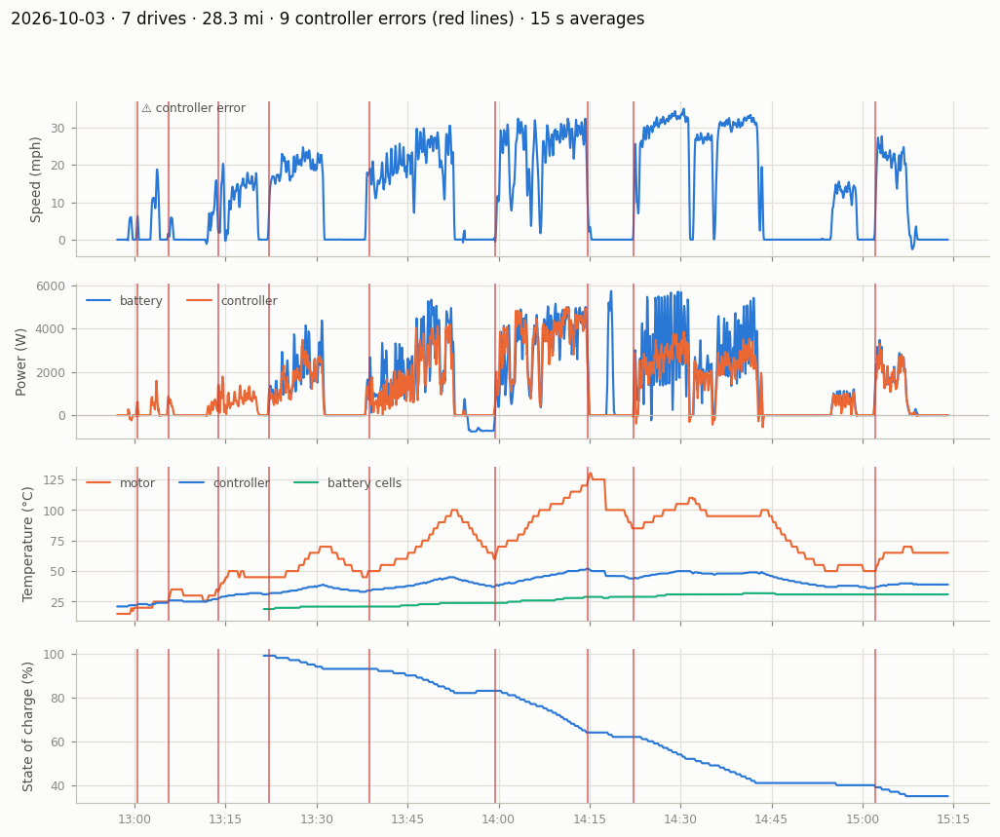
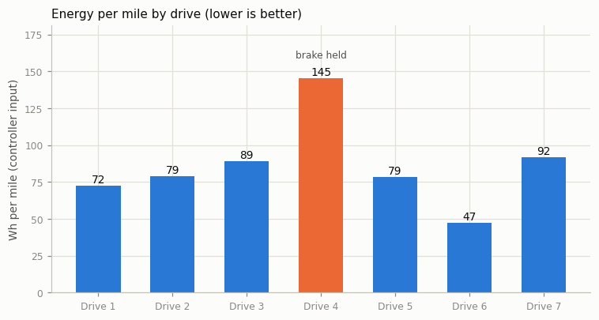
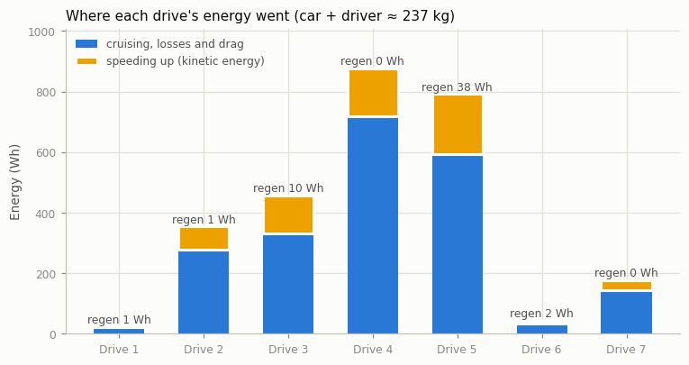
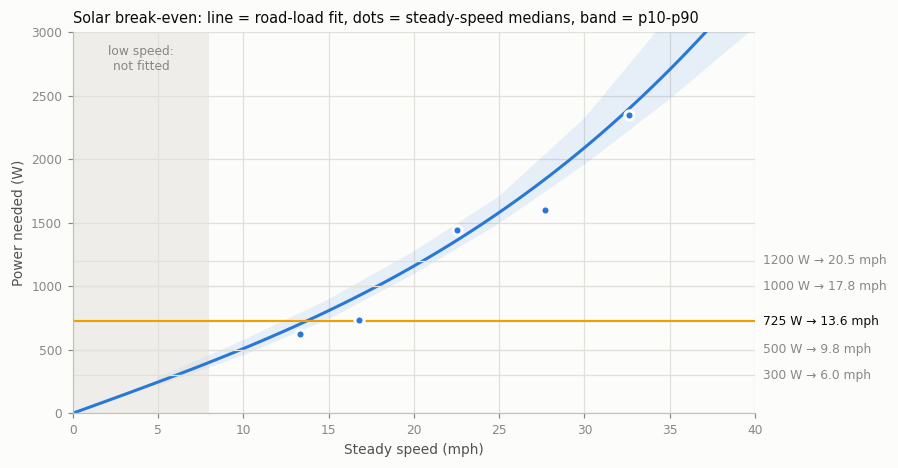
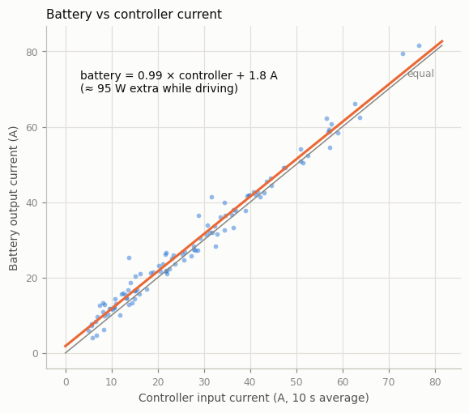

# Solar car telemetry: Saturday 3 October 2026

What we did on the Saturday 3 October 2026 test day, and what the car's data says. The quickest way in
is **`../dashboard.html`** (open it in a web browser); this page has the same story in
more depth, plus the charts and the data behind it.



### What we did

**Telemetry works!** This was our first full day of logging data from the car.

- **Fixing the Texas failure.** Telemetry didn't work at the Texas event because a DIP switch on the USB-to-CAN adapter had been flipped by accident. That put the adapter into firmware-upgrade mode, so it didn't work at all. It took about 2½ hours to track down by simplifying the setup (connecting the car straight to a laptop, etc.). Nothing else in the hardware or software had to change from the Texas setup.
- **Seven drive sessions, about 28 miles** of driving, 2.6 MB of raw data.
- **Higher-resolution logging from about 2:45 pm.** Euan changed the logger so readings come in every 0.5 s instead of every 2 s. The motor controller actually sends data every 0.1 s, so the Raspberry Pi could probably capture all of it.
- **Solar charging stop.** Just before 2 pm the car sat with the solar panels on, charging the battery.
- **Overload errors.** Every driver except Vivaan got a controller "Overload" error; Vivaan went easy on the throttle. We also captured what an "Overload + Motor Stalled" looks like (too much current or a hot motor).
- **Brake held.** In one drive the brake was held down while driving.
- **Flat route.** There were no hills that day.

### First impressions

- We can work out power at the battery output, power at the controller input, and the efficiency between them, and could even do this live in the software.
- The motor sometimes reports backwards motion. That matches the shudder at low speed; the car didn't actually roll backwards.
- GPS was logged automatically from Euan's phone (which wasn't in the car), so adding GPS tracking for the car should be easy.
- Regen when coasting appears to work.
- The Raspberry Pi runs hot. There was no airflow or fan noise.
- Speed and distance probably need calibrating.

## At a glance

| | |
|---|---|
| Drives | 7 between 13:02 and 15:08 (Pacific time) |
| Distance | 28.3 miles |
| Top speed | 39.4 mph |
| Energy used | 2,677 Wh at the motor controller, 95 Wh/mile overall |
| Battery charge | 99% → 35% |
| Hottest motor | 130 °C |
| Controller errors | 9 |
| Solar break-even speed | about 13.6 mph at 725 W of sun |

## What we learned

1. **Controller overloads mostly happen pulling away from a stop.** 7 of the 9 controller errors came within a few seconds of starting from standstill, almost always at 100% throttle. Easing into the throttle from a stop, or lowering the controller's launch current limit, should remove most of them.
2. **Drive 4 was driven with the brake held down, and that's what overheated the motor.** At steady speeds it needed 122 W per mph, against about 49 for the other drives, and it spent 60% of its time at full throttle. It used 145 Wh/mile, roughly double the others, and the motor climbed to 130 °C and stalled at 14:14. It's left out of the efficiency fits below.
3. **The motor can run about 214 A of phase current at 1500 rpm indefinitely.** It heats and cools slowly (about 13 minutes to settle), so short bursts are fine but sustained high current gets it to the stall temperature. See `figures/motor_thermal_model.png`.
4. **Driving style matters a lot.** The most efficient drive was drive 6 at 47 Wh/mile (average 12.4 mph, full throttle 0% of the time). Speeding the car up took 16–28% of each drive's energy, and regen got back at most 19% of that. Fewer stops and gentler starts are the cheapest wins.
5. **Steady cruising on the flat costs about 54 Wh/mile at 15 mph, 63 at 25 and 77 at 35.** The day's overall 95 Wh/mile is higher because of starts, stops and the brake-held drive.
6. **Solar break-even is about 13.6 mph** (likely 12.4–14.7 mph) with 725 W of sun. Below that speed the panels supply everything the motor uses, so the car could keep going as long as the sun holds. The solar figure comes from the charging stop just before 2 pm, so it's the weakest number here; measuring the array properly would firm it up.
7. **The battery supplies about 95 W more than the motor controller reports.** Once both were logging fast, the battery read 1.8 A more than the controller at every load while the motor ran, and the same when parked; otherwise the two agree within 1%. Accessories have their own battery, so either something draws power only while driving or the controller's current sensor reads low. Cables, fuse and contactor lose a little more (about 12.5 mΩ). See `figures/battery_vs_controller.png`.
8. **Battery: about 88.5 Ah per 100% state of charge, against a 100 Ah rating.** The pack delivered 57.5 Ah while charge fell 99% → 35%. Cells stayed well balanced: 4 mV apart at rest and 11.5 mV under load.

## Efficiency in pictures

**Energy per mile, drive by drive.** Lower is better.



**Where each drive's energy went.** Yellow is energy spent speeding the car up; blue is
cruising, drag and losses.



**Power needed at a steady speed**, and where solar alone could keep the car going.



**Battery vs motor controller current.** Dots above the grey "equal" line mean the battery
supplied more than the controller reported.



## Keep in mind

- **Low-speed readings are rough.** Below about 8 mph the motor struggles and speed, rpm and current jump around (the shudder; speed can even read negative). The data is left in, but the efficiency and break-even numbers only use driving above 8 mph.
- **Logging got faster at about 2:45 pm.** Before that the controller was logged every 2 s and the battery current only every ~10 s; after, every 0.5 s and ~1 s. Earlier battery numbers are coarse, so per-drive energy uses the controller's figures.
- **Speed and distance aren't calibrated yet**, so treat miles and mph as close but not exact.
- **Motor temperature is reported in 5 °C steps**, so it looks like a staircase.
- **Energy for speeding up assumes the car plus driver weigh about 237 kg.**
- **The first drive has no battery data**: the battery wasn't sending on the CAN bus yet.

## Drives

| Drive | Start | Miles | Avg mph | Max mph | Wh/mi | Full throttle | Speeding up | Battery | Motor max °C | Errors |
|---|---|---|---|---|---|---|---|---|---|---|
| 1 | 13:02 | 0.33 | 9.7 | 21.6 | 72 | 3% | 16% | – | 35 | 1 |
| 2 | 13:11 | 4.47 | 15.7 | 29.5 | 79 | 10% | 22% | 99 → 93% | 70 | 2 |
| 3 | 13:37 | 5.04 | 20.5 | 35.6 | 89 | 28% | 28% | 93 → 82% | 100 | 1 |
| 4 (brake held) | 13:59 | 6.04 | 23.1 | 37.2 | 145 | 60% | 18% | 83 → 64% | 130 | 2 |
| 5 | 14:22 | 9.60 | 28.4 | 39.4 | 79 | 32% | 25% | 62 → 41% | 110 | 1 |
| 6 | 14:53 | 0.88 | 12.4 | 16.9 | 47 | 0% | 24% | 41 → 40% | 55 | 0 |
| 7 | 15:01 | 1.93 | 17.5 | 32.4 | 92 | 14% | 19% | 40 → 35% | 70 | 1 |

"Speeding up" is the share of the drive's energy that went into accelerating the car.
Charts for each drive: [Drive 1](figures/drive_01.png) · [Drive 2](figures/drive_02.png) · [Drive 3](figures/drive_03.png) · [Drive 4](figures/drive_04.png) · [Drive 5](figures/drive_05.png) · [Drive 6](figures/drive_06.png) · [Drive 7](figures/drive_07.png)

## What's in this folder

| Path | What it is |
|---|---|
| `../dashboard.html` | Interactive version: hover the timeline, zoom to a drive, try the break-even and motor-heat calculators. |
| `figures/` | The charts as images, for slides and chat. |
| `data/telemetry_1s.csv` | **The main data.** One row per second, one column per measurement. Opens in Excel or Google Sheets. |
| `data/data_dictionary.csv` | What every column in `telemetry_1s.csv` means, with units. |
| `data/drives.csv` | One row per drive with totals and peaks. |
| `data/drive_efficiency.csv` | Per-drive driving style and energy: throttle use, speeding-up energy, regen, brake flag. |
| `data/controller_errors.csv` | Every controller error and what the car was doing in the 20 s before it. |
| `data/events.csv` | Log of state changes: errors, drive mode, regen, sensors dropping out. |
| `data/efficiency_vs_speed.csv` | Power and Wh/mile at steady speeds, by speed band. |
| `data/models.json` | Fitted numbers: motor heat, road load / break-even, battery capacity and health, battery-vs-controller gap. |
| `raw/` | The original export from Home Assistant (`solarcar_raw_readings_2026-10-03.xls`). |

## Look at the data yourself

**Spreadsheet:** open `data/telemetry_1s.csv`. Each row is one second. Columns are
described in `data/data_dictionary.csv`. Filter `moving` = TRUE for driving only.

**Python:**

```python
import pandas as pd
df = pd.read_csv("data/telemetry_1s.csv", parse_dates=["time"], index_col="time")
df.loc[df.moving, ["speed_mph", "mc_power_w"]].plot(subplots=True)
```

## Words used here

- **Phase current**: current in the motor windings. It's what heats the motor, and it's
  higher than the battery current at low speed.
- **Bus current / controller power**: what the motor controller draws from the battery.
- **SOC**: state of charge, the battery's percentage.
- **Wh/mile**: energy per mile; lower is better.
- **Break-even speed**: the fastest steady speed at which the solar panels supply all the
  power the motor needs.
- **Regen**: energy recovered into the battery when slowing down.
