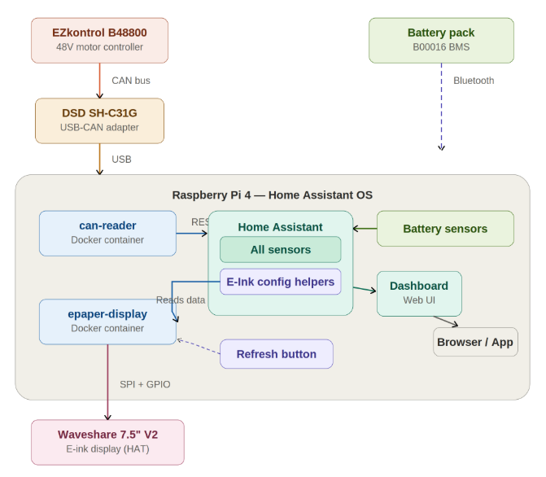
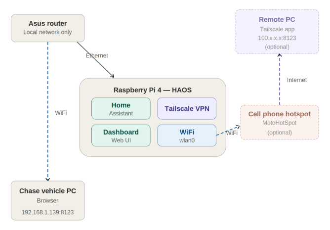
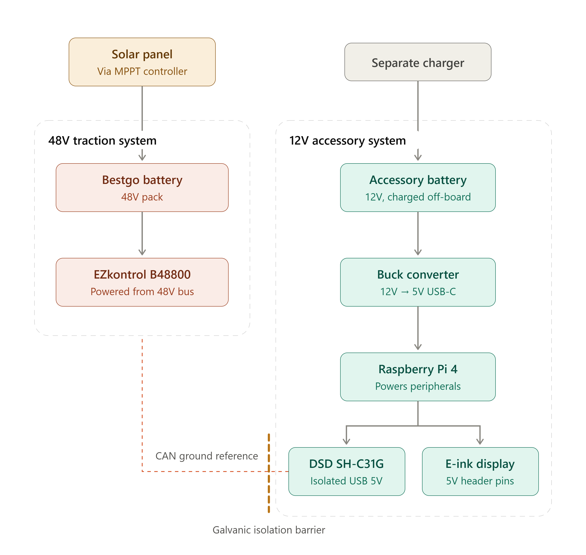

**Solar Car Challenge**

# Telemetry Guide

The Raspberry Pi on the car reads the motor controller and the battery over the CAN bus and shows everything in two places: the **e-ink screen on the car**, and a **Home Assistant dashboard** you open in a browser on your phone, tablet or laptop. This guide covers turning it on, connecting to it, getting the data off it, and what to do when something looks wrong.

You do not need to know anything about the software to use it — just follow [Turning on Telemetry](#turning-on-telemetry), and if something looks off go to [Common Problems](#common-problems).
  
The screen will show some of the most important data to a driver, along with warnings and a message from the dashboard. The clock should constantly change, showing that the system is running (see [The Clock Has Stopped Ticking](#the-clock-in-the-corner-has-stopped-ticking) if it stops). A warning symbol next to a value shows that the Pi is failing to get new data, so that value may be old.

> [!CAUTION]
> **Always shut the Pi down in software before you pull the power.** Yanking 12V from a
> running Pi can corrupt the SD card. See [Shutting Down Safely](#shutting-down-safely).
>
> **Cover the Pi and the screen if you bleed the brakes.** Turns out brake fluid and metal
> filings aren't so good for a Raspberry Pi. Who knew?

## Table of Contents

1. [Quick Start](#quick-start)
2. [Turning on Telemetry](#turning-on-telemetry)
3. [Connecting Your Phone, Tablet or Laptop](#connecting-your-phone-tablet-or-laptop)
4. [Recording and Downloading Data](#recording-and-downloading-data)
5. [Shutting Down Safely](#shutting-down-safely)
6. [Setting Up a New Hotspot](#setting-up-a-new-hotspot)
7. [How the System Works](#how-the-system-works)
8. [Common Problems](#common-problems)

## Quick Start

For anyone who has done this before:

1. Power on the 12V circuit → wait ~30 s for the e-ink screen to redraw.
2. Check the CAN-to-USB adapter shows a **green** LED, not just red.
3. Join the Wi-Fi **dd-wrt** (no password) or the **hotspot**, type the IP from the top of the e-ink screen
   into your browser's address bar, log in with **sct / letsgo**.
4. Turn the car on — motor and battery data should appear on the **Solar Car** tab.

Anything unexpected → [Common Problems](#common-problems).

## Turning on Telemetry

**1. Power on the 12V accessory circuit.** This is the telemetry circuit — separate from the
48V pack that drives the car — and it powers the Raspberry Pi, the router and the e-ink
screen. The car itself does not need to be on yet.

**2. Wait about 30 seconds for the e-ink screen to redraw.** When the dashboard appears, the
Pi has booted.

> [!NOTE]
> An e-ink screen holds its last image even with no power, so a screen with something on it
> does **not** prove the Pi is running. The proof is the **clock in the top-right corner**:
> it is drawn by the Pi, so if it is ticking (updating every few seconds) things are good.
> A clock stuck at an old time means the Pi is not running — usually lost power.

**3. Check the CAN-to-USB adapter.** It is the small clear box at the back of the car with a
USB cable going in and two wires going out.

> [!IMPORTANT]
> It needs a **red LED and at least one green LED**. Red on its own means it is not talking
> to the CAN bus: unplug the USB and plug it back in until the green LED comes on.
> If the green LED comes on but data still doesn't arrive, the add-on needs a restart —
> see [Warning: "CAN adapter disconnected"](#warning-can-adapter-disconnected).
>
> Also check the two little switches on the red board are **up** (the off position) — or at
> least the one labelled "boot".

**4. Turn the car on.** Within a few seconds the motor controller and battery readings should
appear — speed, voltage, current, temperatures, state of charge.

**5. Connect your own device** to see the full dashboard — see the next section.

## Connecting Your Phone, Tablet or Laptop

There are two networks you can join. Which one you use decides what you can reach:

| Network | What it is | Use it when |
| --- | --- | --- |
| **Router** (`dd-wrt`) | The car's own Wi-Fi, from the router wired to the Pi. **No internet.** | You are at the car or in the chase vehicle. This is the normal one. |
| **Hotspot** | Someone's phone hotspot that the Pi has also joined. Has internet. | You need internet on the same network, or remote help debugging the Pi. |

**Joining the router Wi-Fi.** Connect to the Wi-Fi network **dd-wrt** — there is no password.
Because this network has no route to the internet, your phone will complain and try to jump
back to mobile data or another Wi-Fi. Tell it to stay connected anyway ("Stay connected",
"Use without internet", or something along those lines). The iPad is already set up for this
network and will reconnect on its own.

**Joining the hotspot instead.** Ask whoever is running the hotspot (likely Andy) for the
name and password. The iPad can use this too, though it is set up for the router.

**Opening the dashboard.** The top of the e-ink screen lists the address to use — a **Router**
row and, if the hotspot is connected, a **Hotspot** row, for example `192.168.1.146:8123`.
Type the one that matches the network you joined into your browser's **address bar**, exactly
as shown, including the `:8123`.

> [!TIP]
> Make sure you aren't doing a Google search — some phones treat anything typed in the top bar
> as a search. It has to go in as a web address. If a search results page comes up, type it
> again and look for an option like "Go to this address".
>
> There are also **Connect to Pi** QR codes on the dashboard — scanning one opens the right
> address for you.

**Logging in.** User **sct**, password **letsgo** (all lowercase).

**What to look at.** Pick the **Solar Car** tab in the sidebar on the left — that is the view
with the important data on it: motor and battery readings, the warnings currently showing on
the e-ink screen, the data-recording controls, and the shutdown button.

## Recording and Downloading Data

**Collecting data for analysis.** The **Update interval** box on the Solar Car tab sets how
often readings are recorded, in seconds (2 is the everyday setting). For finer detail during a
test run set it to 0.5 (or tap the 0.5 s button); 0.2 is fine for a short burst. The e-ink
screen won't look any different. Put it back to 2 afterwards so the Pi isn't working harder
than it needs to.

**Downloading the data.** Open **Telemetry Export** in the Home Assistant sidebar (or
`http://<pi ip>:8099/` on the car's Wi-Fi), pick "last 1 h" / "last 6 h" or a from–to window,
and you get one CSV with every motor-controller and battery reading in it, pulled from Home
Assistant's own history. It opens in Excel / Google Sheets. Times in the file are UTC.

Home Assistant keeps about **10 days** of history, so download a run within a week or so of
driving it. Further down the page you can tick/untick which readings go in the file and add any
other Home Assistant entity; press **Save** to keep that list, **Reset to defaults** to go
back.

## Shutting Down Safely

Pulling the power from a running Raspberry Pi can corrupt its SD card, which means re-flashing
it. Always do this instead:

1. In Home Assistant, open the **Solar Car** tab and scroll to the bottom.
2. Press **Shut Down Pi** and confirm the dialog.
3. Wait for the e-ink screen to show the **poweroff** message — up to about a minute.
4. Now it is safe to switch off the 12V circuit.

The Pi is fully off after this and will only come back when the 12V circuit is power-cycled.

> [!NOTE]
> If Home Assistant is unreachable and the Pi is unresponsive anyway, you have no choice but to
> cut the power — but try the dashboard first.
>
> In case of SD card failure there is a backup card, as well as a backup Pi.
>
> The Pi's power cord is very hard to remove; filing down the opening makes it go in and out
> more easily. Until then you might need pliers.

## Setting Up a New Hotspot

This lets the Pi reach the internet through a phone hotspot, so the telemetry can be reached
from off the car and a remote helper can debug it.

Go to `settings/system/network` in Home Assistant and connect the new hotspot there. If the
network screen shows an error, set the hotspot up from the **Terminal** instead:

`docker run --rm -it --privileged --pid=host alpine nsenter -t 1 -m -u -n -i sh`

`nmcli connection show`

`nmcli connection add type wifi ifname wlan0 con-name hotspot ssid "WIFINAME" wifi-sec.key-mgmt wpa-psk wifi-sec.psk "WIFIPASSWORD"`

`nmcli connection show`

Replace `WIFINAME` and `WIFIPASSWORD` with the hotspot's name and password, keeping the
quotes. The last command should now list `hotspot`, and within a few seconds the e-ink header
should gain a **Hotspot** row with its IP.

## How the System Works

A quick picture of what's going on under the hood — handy if something looks wrong, or if
you're explaining the setup to someone else.

### Data flow — where the numbers come from

The motor controller (EZkontrol) and the battery (BESTGO) share one CAN bus. The USB-CAN
adapter feeds that into the Raspberry Pi, where a small app decodes it and posts every reading
into Home Assistant as a sensor. From there the same data drives two things: the Home Assistant
dashboard you open in a browser, and the e-ink screen on the car. So everything you see — on
your phone and on the physical display — comes from those sensors.

Two apps do the work, and both restart automatically with Home Assistant:

| App | Job |
| --- | --- |
| **Solar Car CANbus Reader** | Reads the CAN bus and pushes every decoded reading into Home Assistant. Also serves the Telemetry Export page on port 8099. |
| **Solar Car E-Ink Display** | Reads those Home Assistant sensors and draws the screen on the car. |

That order matters when you are chasing a fault: the e-ink screen is downstream of everything,
so what it shows tells you *where* the chain broke. "CAN adapter disconnected" means the data
stopped before the Pi; "Home Assistant unreachable" means the display can't reach Home
Assistant; "Pi Offline" means it doesn't even know its own address yet.

The display works out that a device is off the bus when its readings stop arriving. A reading
that simply stops *changing* is not a fault (a parked car, a settled temperature), so there is
deliberately no warning for that.

### Network — how you connect to it

The Raspberry Pi is wired to the ASUS router. Your chase-vehicle iPad or any cellphone joins
that router's WiFi and opens Home Assistant at its IP address. This network is local only, with
no route to the internet, which is why your phone may complain and try to jump back to mobile
data. Optionally the Pi can also join a cell-phone hotspot; that gives it internet so a remote
helper (Euan) can reach it over the Tailscale VPN for debugging. Rule of thumb:
**router = you in the chase vehicle, hotspot = remote help over the internet.**

The Pi can be on both at once, which is why the e-ink header can show two addresses. Each
address only works from the matching network.

### Power — what you're switching on

There are two separate power systems. The 48V traction side (solar panel → BESTGO pack →
EZkontrol) moves the car. The 12V accessory side runs all the telemetry: its own battery feeds
a buck converter that makes 5V for the Raspberry Pi, which in turn powers the CAN adapter and
the e-ink display. The "power on the 12v circuit" in step 1 is this accessory side — that's
what boots the Pi and router, independent of the traction pack.

The two sides are electrically isolated (the isolation barrier); the only link between them is
the CAN adapter, which is isolated on purpose so the low-voltage electronics stay protected.
This is also why the telemetry can be up with the car switched off — and why the motor shows
as disconnected until you turn the car on.

## Common Problems

Start here. The first column is what you actually see.

| What you see | Usually means | Fix |
| --- | --- | --- |
| Screen blank, or nothing changed after power-on | Still booting, or no 12V | [Screen is blank](#the-e-ink-screen-is-blank-or-looks-unchanged-after-power-on) |
| Clock in the corner has stopped | Pi lost power or crashed | [Clock has stopped](#the-clock-in-the-corner-has-stopped-ticking) |
| "Pi Offline" / "Home Assistant unreachable" | Home Assistant restarting | [Pi Offline](#the-screen-says-pi-offline-or-home-assistant-unreachable) |
| "CAN adapter disconnected" | Adapter not on the bus | [CAN adapter](#warning-can-adapter-disconnected) |
| "Battery disconnected" / "Motor disconnected" | One device off the bus | [One device missing](#warning-battery-disconnected-or-motor-disconnected) |
| Browser won't load the dashboard | Wrong address or wrong network | [Can't load dashboard](#my-phone-wont-load-the-dashboard) |
| Phone keeps leaving the car's Wi-Fi | No internet on that network | [Phone drops the Wi-Fi](#my-phone-keeps-dropping-the-cars-wi-fi) |
| Dashboard loads but values are blank or "unknown" | CANbus app not running | [Blank values](#the-dashboard-loads-but-the-numbers-are-blank-or-unknown) |
| A number never changes | Probably normal | [Frozen reading](#a-reading-looks-frozen-but-theres-no-warning) |
| "High temp" warnings | Something is genuinely hot | [High temp](#high-temp-warnings) |
| Export page won't open / CSV has gaps | Window, history limit, or missing sensor | [Export trouble](#the-export-page-wont-open-or-the-csv-is-missing-data) |
| Too many warnings on the screen | Known ones can be hidden | [Too many warnings](#too-many-warnings-on-the-e-ink-screen) |

### The e-ink screen is blank, or looks unchanged after power-on

Give it 30–60 seconds; the Pi has to boot before it draws anything. Then:

- **Completely blank** → check the 12V circuit is actually on, that the Pi's 5V cord is fully
  seated (it is very tight) and that the buck converter has power.
- **Shows a dashboard but the clock is old** → the image is just the last thing drawn before
  the Pi lost power. Treat it as "not running" and see the next item.

### The clock in the corner has stopped ticking

The Pi has stopped, almost always a power problem: the 12V accessory battery is flat or
disconnected, or the 5V cord has worked loose. Check power first, then power-cycle the 12V
circuit and wait 30 s for the screen to redraw.

If it comes back and keeps dying, suspect the accessory battery's charge — check the AUX
battery readings on the dashboard.

### The screen says "Pi Offline" or "Home Assistant unreachable"

The display app is running (so the Pi is alive) but Home Assistant itself isn't answering.
That is normal for a minute or two after a restart, so wait. If it stays that way, reboot the
Pi from the dashboard if you can reach it, otherwise power-cycle the 12V circuit.

Important: while this warning is showing, the display *cannot* tell you anything about the CAN
bus — the data stops at Home Assistant, not at the bus. Fix this one first.

### Warning: "CAN adapter disconnected"

No data at all is arriving from the motor controller or the battery. Work through it in order:

1. **Look at the adapter** — the small clear box with USB in, wires out. It should show a red
   LED **and** at least one green LED. Red only means it is not talking to the bus.
2. **Check the switches** — both tiny switches on the red board should be **up** (the off
   position), or at the very least the one labelled "boot".
3. **Unplug the USB and plug it back in**, until the green LED comes on.
4. **Then restart the add-on.** This step is easy to miss, and is usually why a replug "didn't
   work": when the adapter is unplugged, the Pi's CAN interface comes back switched *off*, and
   only the app's startup switches it on again. In Home Assistant go
   **Settings → Add-ons → Solar Car CANbus Reader → Restart**. Data should return within a few
   seconds.
5. If you can't reach Home Assistant, power-cycling the whole 12V circuit does the same thing —
   [shut the Pi down properly](#shutting-down-safely) first if the dashboard is reachable.
6. Still nothing? Check the CAN wires at the adapter end and at the car end — a wire-side
   unplug looks identical from the Pi's point of view.

### Warning: "Battery disconnected" or "Motor disconnected"

One device has stopped sending, while the adapter itself is fine.

- **"Motor disconnected" with the car switched off is normal** — the EZkontrol only talks when
  the car is on. Turn the car on and it should clear within a few seconds.
- **"Battery disconnected"** → check the CAN wiring to the BESTGO pack, and that the pack is
  switched on.
- **Both at once, without the adapter warning** → look at the shared CAN wiring and
  termination rather than at either device.

### My phone won't load the dashboard

- **Check the address.** Read it off the top of the e-ink screen and type it exactly, including
  the `:8123` — for example `192.168.1.146:8123`. It has to go in the browser's address bar,
  not a search box. The IP can change between sessions, so use what the screen says now, not
  what you remember.
- **Check you are using the right row.** The Router address only works from the `dd-wrt` Wi-Fi;
  the Hotspot address only works from the hotspot.
- **Check you are still on the car's Wi-Fi** — phones switch back to mobile data silently.
- **Login fails?** It is user **sct**, password **letsgo**, all lowercase.
- Easiest fix of all: scan the **Connect to Pi** QR code.
- The Pi may just still be turning on. The the webpage is often last to boot up.

### My phone keeps dropping the car's Wi-Fi

That is the phone deciding a network with no internet isn't worth staying on. Choose "stay
connected" when it asks. If it keeps hopping, turning mobile data off for a few minutes forces
it to stay put — turn it back on afterwards.

### The dashboard loads but the numbers are blank or "unknown"

If the car isn't on yet, this is normal. Otherwise, Home Assistant is up but nothing is feeding it. Check
**Settings → Add-ons → Solar Car CANbus Reader** — it should say *Started*. If it isn't, start
it; if it is, open its **Log** tab, which says what it is doing (bringing up the interface,
retrying, or pushing readings). Readings that were there a moment ago and are now flat are
usually the adapter — see [CAN adapter disconnected](#warning-can-adapter-disconnected).

### A reading looks frozen but there's no warning

Usually correct behaviour. The system only warns when a device stops talking altogether, not
when a number stops changing — a parked car really does report 0 mph, and a settled temperature
really does stay put. To confirm it is live, watch something that always moves (bus voltage, a
temperature), or tap the reading to see its history graph.

### High temp warnings

Not a software problem — something is genuinely above its warning threshold. Check the named
reading on the dashboard, and give the car a rest if it is the motor or the controller. These
warnings are only raised off live readings, so a stale sensor won't set off a false alarm.

### The export page won't open, or the CSV is missing data

- **Page won't open** → use **Telemetry Export** in the Home Assistant sidebar, or
  `http://<pi ip>:8099/` while on the car's Wi-Fi. If neither works, the CANbus app isn't
  running — see [blank values](#the-dashboard-loads-but-the-numbers-are-blank-or-unknown).
- **A column is blank** → that sensor didn't exist during the window you asked for (common
  right after a Home Assistant restart). Everything else in the file is still good.
- **Nothing in the window** → check the from–to times. The file is in **UTC**, not local time.
- **An old run is gone** → Home Assistant keeps roughly 10 days of history, so download runs
  within a week.

### Too many warnings on the e-ink screen

Known, understood warnings can be hidden so the screen stays readable. On the dashboard's
**E-Paper Warnings** card each active warning has a **Hide** button, hidden ones have a
**Show** button, and there is an **Unhide all**. Hiding only changes the car's screen — the
reading and the dashboard are unaffected — and a warning that stops being active drops off the
list by itself.

---
