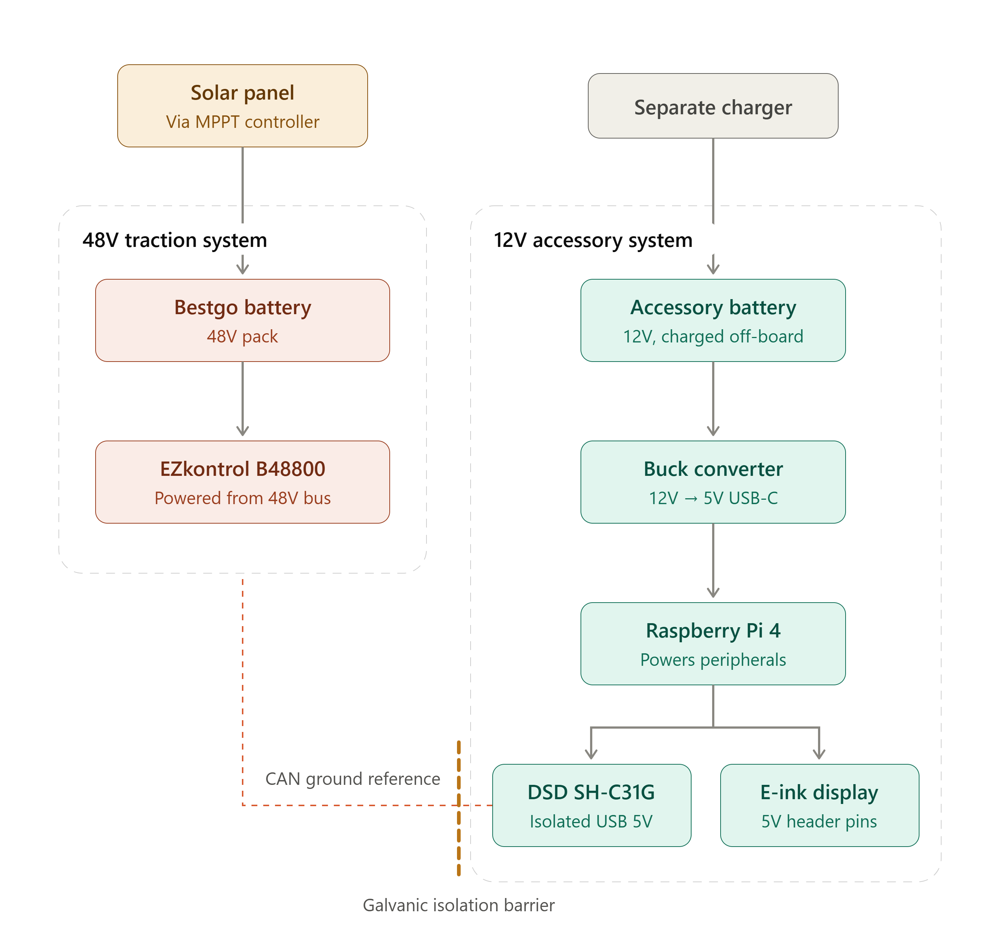

### Solar Car Challenge 2026

**Telemetry user guide**

> [!NOTE]
> The ipad will quickly connect to the solar car, but any device can connect to the rpi system with the steps below.

1. power on 12v circuit, it will turn on the rpi and the router.  The eink dashboard should turn on after 30 seconds, that means rpi booted successfully.
> [!IMPORTANT]
> Look at the CAN to USB adapter.
> If it only has the red led on (no green) unplug and replug it until the green led turns on.
2. The clock in upper right of the e-ink should be ticking every few seconds: it is controlled by the rpi and means things look good.  if it stops that means something is wrong, likely power loss.
3. connect phone to the wifi "dd-wrt", there is no password.  it is a LAN wifi (no route to the internet), so you might need to tell your phone this (stay connected anyway, or something along those lines) Phones will want to jump back to mobile data or another wifi where it can see the internet.  The ipad is setup to connect long term.
5. the e-ink dash should display the ip of home assitant.  probaly `192.168.1.146:8123`
6. put that into your phone browser to see home assistant login.  (make sure you arent doing a google search, just enter as a url)
user:sct, passwd: letsgo

7. when ezkontrol is turned on you should see data from it, see the
"solar car" tab in home assistant on the left in home assistant for most important data.

8. settings/system/network To connect a new cell phone hotspot, this will allow the home assistant to get though to the interent so Euan can help with remote debug.
   There is a network screen error, so need to setup hotspot wifi from a terminal:
`docker run --rm -it --privileged --pid=host alpine nsenter -t 1 -m -u -n -i sh
nmcli connection show
nmcli connection add type wifi ifname wlan0 con-name hotspot ssid "Isabel" wifi-sec.key-mgmt wpa-psk wifi-sec.psk "!sab3lw!f!!"
nmcli connection show`

details coming here from Evana

> [!IMPORTANT]
> to turn off the home assistant it is best to do a software shutdown before unplugging the power, it avoids possible sdcard corruption.  under solarcar tab, push the shutdown system button at the bottom and wait for screen to show poweroff message, maybe 1 minute.

> [!CAUTION]
> Only the Ezkontrol is connected right now, not the bestgo battery.
> > We never got a chance to test some recent software changes, and will need a little work to try a new CANbus cable. in the meantime, use the Smart BMS app (hold it very close to the battery) to get actual value of SOC, don't trust the battery displays until they are calibrated.

in case of sdcard failure we will have a backup, as well as a backup rpi.

[!NOTE]
The power cord for the pi is very hard to remove, recommended to file down the opening to make it go in and out easier.  Now you might need some pliers to remove!  Also cover the pi and screen if you bleed the brakes, turns out brake fluid and metal filings aren't so good for a raspberry pi.  Who knew?

---

### How the system works

A quick picture of what's going on under the hood — handy if something looks wrong, or if you're explaining the setup to someone else.

#### Data flow — where the numbers come from

The motor controller (EZkontrol) and the battery (BESTGO) share one CAN bus. The USB-CAN adapter feeds that into the Raspberry Pi, where a small app decodes it and posts every reading into Home Assistant as a sensor. From there the same data drives two things: the Home Assistant dashboard you open in a browser, and the e-ink screen on the car. So everything you see — on your phone and on the physical display — comes from those sensors.

#### Network — how you connect to it

The Raspberry Pi is wired to the Asus router. Your chase-vehicle iPad or any cellphone joins that router's WiFi and opens Home Assistant at its IP address (step 3 above). This network is local only, with no route to the internet, which is why your phone may complain and try to jump back to mobile data. Optionally the Pi can also join a cell-phone hotspot; that gives it internet so a remote helper (Euan) can reach it over the Tailscale VPN for debugging. Rule of thumb: **router = you in the chase vehicle, hotspot = remote help over the internet.**

#### Power — what you're switching on

There are two separate power systems. The 48V traction side (solar panel → BESTGO pack → EZkontrol) moves the car. The 12V accessory side runs all the telemetry: its own battery feeds a buck converter that makes 5V for the Raspberry Pi, which in turn powers the CAN adapter and the e-ink display. The "power on the 12v circuit" in step 1 is this accessory side — that's what boots the Pi and router, independent of the traction pack. The two sides are electrically isolated (the isolation barrier); the only link between them is the CAN adapter, which is isolated on purpose so the low-voltage electronics stay protected.
